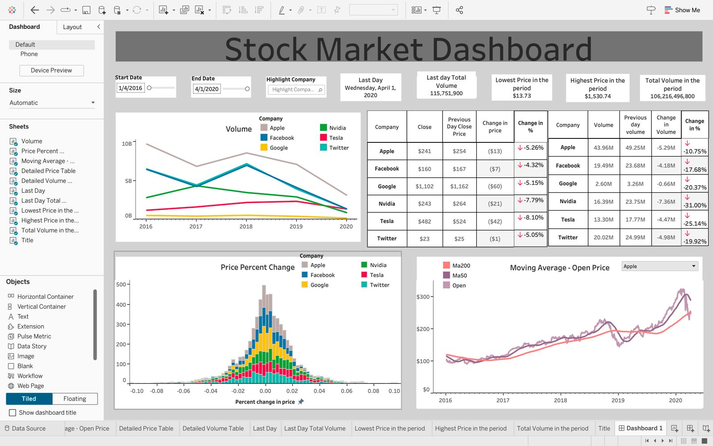

# Stock Market Dashboard

This project provides a comprehensive Stock Market Dashboard created using Python and Tableau. It allows users to visualize and analyze stock performance for major companies over a given time period.

## Features

- **Interactive Tableau Dashboard**:
  - Displays stock price and volume trends for Apple, Facebook, Google, Nvidia, Tesla, and Twitter.
  - Histogram of percentage changes in stock prices.
  - Moving averages (50-day and 200-day) for stock prices.
  - Summary statistics for stock price performance and volume.

- **Python Notebook for Data Preprocessing**:
  - Extracts and processes stock data for each company.
  - Outputs processed data in CSV format for use in Tableau.

## Files Included

- **Python Notebook**: [`stock_market.ipynb`](./stock_market.ipynb) - Python code for data cleaning and preparation.
- **CSV Files**:
  - [`Apple.csv`](./Apple.csv)
  - [`Facebook.csv`](./Facebook.csv)
  - [`Google.csv`](./Google.csv)
  - [`Nvidia.csv`](./Nvidia.csv)
  - [`Tesla.csv`](./Tesla.csv)
  - [`Twitter.csv`](./Twitter.csv)
- **Tableau Dashboard Image**: 

- Screenshot of the Tableau dashboard.

## Requirements

### Python Dependencies

- Python 3.x
- Pandas
- NumPy
- Matplotlib (optional for additional visualizations)

### Tableau

- Tableau Desktop or Tableau Public for visualizing the dashboard.
